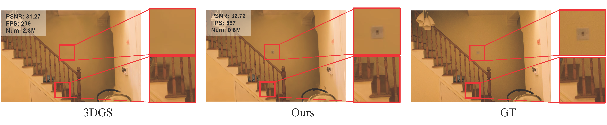

### Efficient Density Control for 3D Gaussian Splatting

Xiaobin Deng, Changyu Diao, Min Li, Ruohan Yu, Duanqing Xu 

### Abstract

3D Gaussian Splatting (3DGS) excels in novel view synthesis, balancing advanced rendering quality with real-time performance. However, in trained scenes, a large number of Gaussians with low opacity significantly increase rendering costs. This issue arises due to flaws in the split and clone operations during the densification process, which lead to extensive Gaussian overlap and subsequent opacity reduction. To enhance the efficiency of Gaussian utilization, we improve the adaptive density control of 3DGS. First, we introduce a more efficient long-axis split operation to replace the original clone and split, which mitigates Gaussian overlap and improves densification efficiency. Second, we propose a simple adaptive pruning technique to reduce the number of low-opacity Gaussians. Finally, by dynamically lowering the splitting threshold and applying importance weighting, the efficiency of Gaussian utilization is further improved. We evaluate our proposed method on various challenging real-world datasets. Experimental results show that our Efficient Density Control (EDC) can enhance both the rendering speed and quality.

Arxiv: https://arxiv.org/abs/2411.10133

<section class="section" id="BibTeX">
  

    <h2 class="title">BibTeX</h2>
    <pre><code>@article{deng2024efficient,
  title={Efficient Density Control for 3D Gaussian Splatting},
  author={Deng, Xiaobin and Diao, Changyu and Li, Min and Yu, Ruohan and Xu, Duanqing},
  journal={arXiv preprint arXiv:2411.10133},
  year={2024}
}</code></pre>
  

</section>

### Running

Our code is built upon the open-source 3DGS code. You can follow the 3DGS tutorial https://github.com/graphdeco-inria/gaussian-splatting or  read file ‘3DGS-README.md’ to install and run our code.
