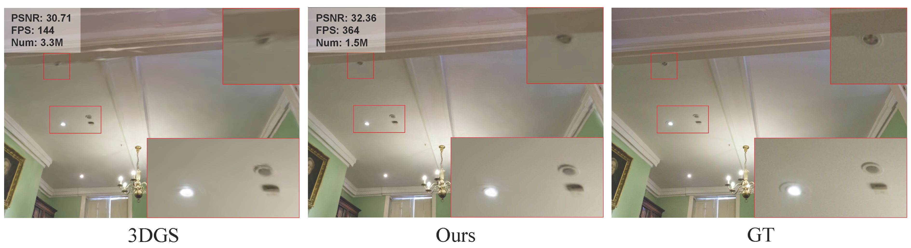

### Efficient Density Control for 3D Gaussian Splatting

Xiaobin Deng, Changyu Diao, Min Li, Ruohan Yu, Duanqing Xu 

### News

We have released a new version, which, compared to the previous one, eliminates heuristic adaptive pruning, importance weighting, dynamic thresholding, and threshold adjustments. The new version introduces Recovery-Aware Pruning. It also evaluates the improvements of EDC on 3DGS, TamingGS (w/o AbsGS), and MiniGS, with additional experimental analysis included. We welcome everyone to read it.

We will also provide EDC code based on TamingGS and MiniGS. If you wish to use it, you must comply with the licenses of the aforementioned works.

### Abstract

3D Gaussian Splatting (3DGS) has demonstrated outstanding performance in novel view synthesis, achieving a balance between rendering quality and real-time performance. 3DGS employs Adaptive Density Control (ADC) to increase the number of Gaussians. However, the clone and split operations within ADC are not sufficiently efficient, impacting optimization speed and detail recovery. Additionally, overfitted Gaussians that affect rendering quality may exist, and the original ADC is unable to remove them. To address these issues, we propose two key innovations: (1) Long-Axis Split, which precisely controls the position, shape, and opacity of child Gaussians to minimize the difference before and after splitting. (2) Recovery-Aware Pruning, which leverages differences in recovery speed after resetting opacity to prune overfitted Gaussians, thereby improving generalization performance. Experimental results show that our method significantly enhances rendering quality.

Arxiv: https://arxiv.org/abs/2411.10133

### Running

Our code is built upon the open-source 3DGS code. You can follow the 3DGS tutorial https://github.com/graphdeco-inria/gaussian-splatting or  read file ‘3DGS-README.md’ to install and run our code.

The code we provide by default incorporates the average gradient computation method proposed in AbsGS. If you wish to use the submodules/diff-gaussian-rasterization from 3DGS, you will need to use `add_densification_stats` instead of `add_densification_stats_abs` in `train.py`. Additionally, you will need to replace the code initializing `screenspace_points` in `gaussian_renderer/__init__.py`. However, I still recommend using the submodules we provide, as the installation process and dependencies are the same as those in the original method's submodules. By using our submodules, you can still decide whether to use the Abs Version by selecting `add_densification`.

### Hyperparameters

You can adjust the ratio by which opacity is reduced after splitting in the `densify_and_split_EDC` method. You can also modify the `rate` parameter in the arguments, which determines the scaling factor for the reduction of other axes. Additionally, you can adjust the pruning threshold and timing in Recovery-Aware Pruning—increasing the threshold or pruning earlier will raise the proportion of Gaussians that are pruned.

<section class="section" id="BibTeX">
  

    <h2 class="title">BibTeX</h2>
    <pre><code>@article{deng2024efficient,
  title={Efficient Density Control for 3D Gaussian Splatting},
  author={Deng, Xiaobin and Diao, Changyu and Li, Min and Yu, Ruohan and Xu, Duanqing},
  journal={arXiv preprint arXiv:2411.10133},
  year={2024}
}</code></pre>
  

</section>

